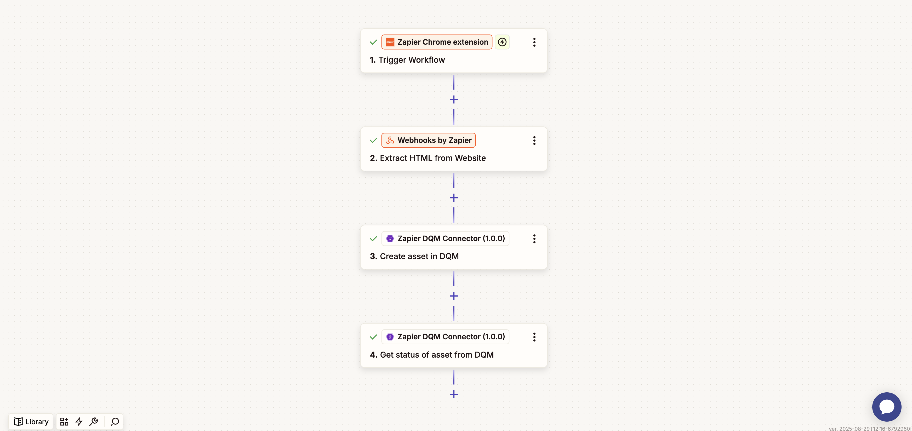
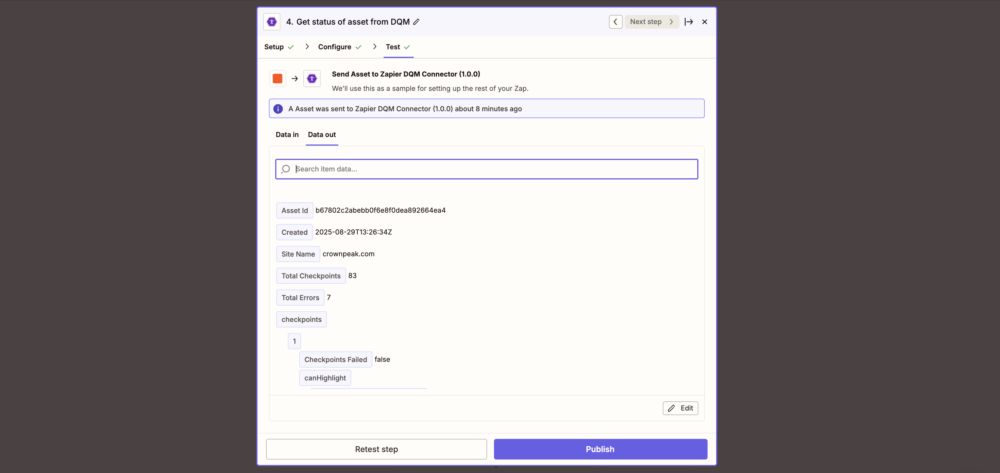

<a href="http://www.crownpeak.com" target="_blank">
  
</a>

# Zapier DQM Connector

## Overview
This repository provides a custom **Zapier integration** for the [Crownpeak DQM CMS API](https://developer.crownpeak.com/DQM/cms/index.html). It enables direct access to asset operations such as creation, retrieval, and spellcheck quality analysis within an Zapier workflow.

## What is it?
A Zapier integration designed to simplify integration with Crownpeak DQM's CMS API using secure and structured credential management. It supports:

- Authenticate securely using API key credentials.
- Manage assets end-to-end: create, update, delete, and fetch content and status.
- Inspect asset issues via spellcheck, page highlights, and checkpoint errors.
- Access checkpoint and website data with tailored workflows.
- Chain operations using dynamic expressions, building automated quality pipelines.

## What is it for?
This integration is useful for organizations using Crownpeak DQM who want to:

- Automate quality checks on web content
- Schedule or trigger DQM scans from CMS or DAM systems
- Include DQM analysis within broader content approval workflows

---

## Installation & Usage

### As a private Zapier integration

1. Clone this repository to your local machine:
    ```bash
    git clone https://github.com/Crownpeak/zapier-dqm-connector.git
    ```
2. Install dependencies:
    ```bash
    npm install
    ```
3. Create a Zapier developer account at https://zapier.com/developer.


4. Install the Zapier Platform CLI:
    ```bash
    npm install -g zapier-platform-cli
    ```
5. Login to your Zapier account:
    ```bash
    zapier login
    ```
6. Register a new app. This needs to be done only once:
    ```bash
    zapier register
    ```
7. Deploy the integration to your Zapier account:
    ```bash
    zapier push
    ```
8. Create a new Zap. Actions from the deployed integration can now be selected in your Zapier workflows.
---

### As a public Zapier integration (once approved)

Once this integration is approved and published on the official [Zapier integrations registry](https://zapier.com/apps), it can be used directly without the need for local setup.

---

## Node Features

| Operation                          | Method | Endpoint Route                                                 | Description                                   |
| ---------------------------------- | ------ | -------------------------------------------------------------- | --------------------------------------------- |
| **List Assets**                    | GET    | `/assets?apiKey&websiteId&limit`                               | Paginated asset listing with optional filters |
| **Get Asset Details**              | GET    | `/assets/:assetId?apiKey&websiteId`                            | Full metadata for a specific asset            |
| **Get Asset Content**              | GET    | `/assets/:assetId/content?apiKey&websiteId`                    | Fetch raw HTML/text of the asset              |
| **Get Asset Status**               | GET    | `/assets/:assetId/status?apiKey&websiteId`                     | Processing status of the asset                |
| **Get Spellcheck Issues**          | GET    | `/assets/:assetId/spellcheck?apiKey&websiteId`                 | Spelling/grammar issues identified            |
| **Get Asset Errors by Checkpoint** | GET    | `/assets/:assetId/errors/:checkpointId?apiKey&websiteId`       | Errors for asset at a specific checkpoint     |
| **Get Asset Page Highlights**      | GET    | `/assets/:assetId/pagehighlight/all?apiKey&websiteId`          | Page-level highlights of quality issues       |
| **Create Asset**                   | POST   | `/assets?apiKey` (body: `websiteId`, `content`, `contentType`) | Submit new asset                              |
| **Update Asset**                   | PUT    | `/assets/:assetId?apiKey` (body: `websiteId`, `content`)       | Update content or trigger re-analysis         |
| **Delete Asset**                   | DELETE | `/assets/:assetId?apiKey&websiteId`                            | Remove asset and associated results           |
| **List Websites**                  | GET    | `/websites?apiKey`                                             | Fetch all websites configured                 |
| **Get Website Details**            | GET    | `/websites/:websiteId?apiKey`                                  | Metadata for a specific website               |
| **Get Website Checkpoints**        | GET    | `/websites/:websiteId/checkpoints?apiKey`                      | Checkpoints configured on a website           |
| **List Checkpoints**               | GET    | `/checkpoints?apiKey`                                          | Full set of available quality checkpoints     |
| **Get Checkpoint Details**         | GET    | `/checkpoints/:checkpointId?apiKey`                            | Specific checkpoint metadata                  |

Each method supports query parameterization using dynamic expressions and securely authenticates using an API key.

---

## 📸 Screenshots

1. A basic workflow example using the Zapier DQM Connector
   

2. The result of /assets/{assetId}/status for a specified asset
   

---

## Support

- This repository is maintained by Crownpeak and released under the MIT License.
- For Crownpeak platform questions, please contact your Customer Success Manager or [support@crownpeak.com](mailto:support@crownpeak.com).
- For Zapier integration issues or pull requests, use GitHub Issues or Discussions.

---

## License

MIT © Crownpeak Technology, Inc.  
See [LICENSE](./LICENSE) for details.